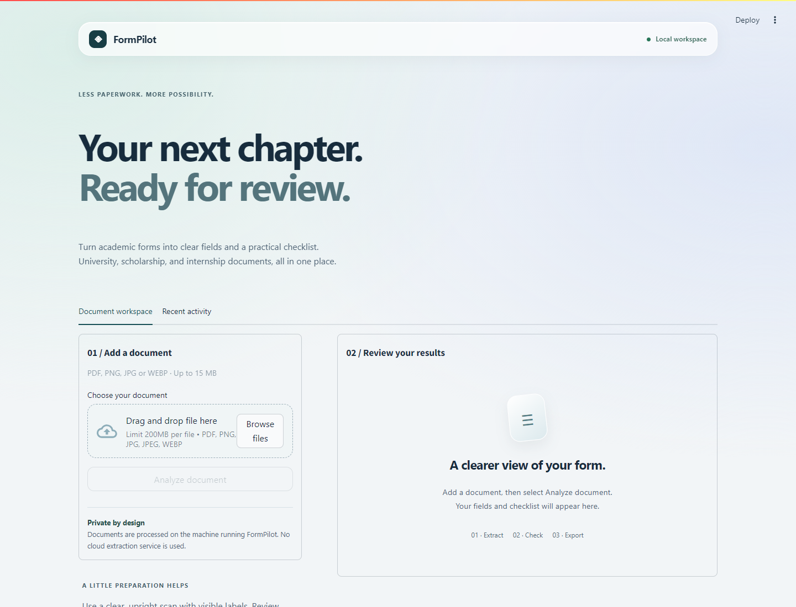
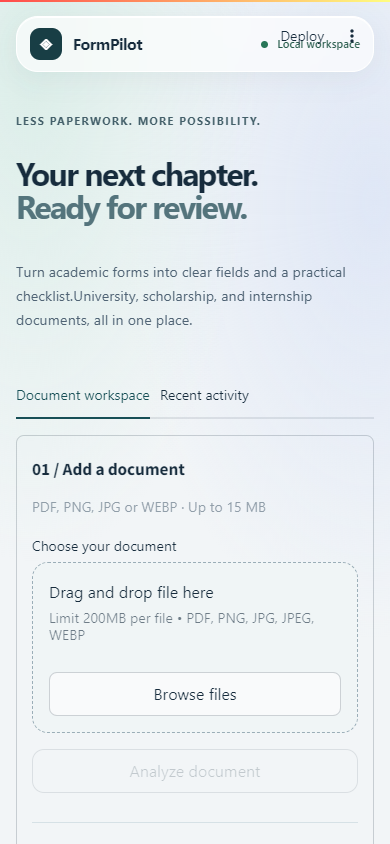

# FormPilot

Offline document extraction and validation for Malaysian students.

## Screenshots

### Desktop workspace



### Mobile workspace



## Run locally

Install Tesseract, then:

```powershell
python -m venv .venv
.venv\Scripts\Activate.ps1
pip install -r requirements.txt
streamlit run streamlit_app.py
```

The API is available with `uvicorn app.api:app --reload` and exposes `GET /health` and `POST /extract`.

## Docker

```powershell
docker compose up --build
```

Open `http://localhost:8501`. Processing is local and the SQLite database stores metadata only.

## Evaluation

```powershell
python evaluate.py
pytest
```

The included fixture is only a smoke-test dataset. Replace it with labelled Malaysian forms before reporting portfolio metrics.

## Optional classifier training

The default classifier is deterministic and works without a model file. To train the included scikit-learn TF-IDF classifier from labelled examples, run:

    python train_classifier.py

The generated model stays local under models/ and is ignored by Git.
